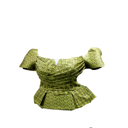
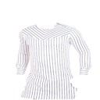
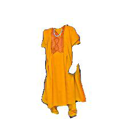
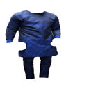
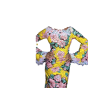
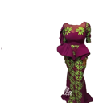
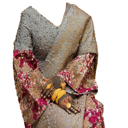

# Oge
_"`Oge` incorporates within its meaning fashion, trendiness and generally being with the times."_


See [Aesthetics of Recreational Dances as Exemplified in the Oge Dance](https://www.jstor.org/stable/1478625) by Omofolabo Soyinka Ajayi.

## Data

This project uses the [AfriFashion1600](https://ieeexplore.ieee.org/abstract/document/9522852) Dataset developed by researchers at [Data Science Nigeria](https://www.datasciencenigeria.org/). It contains 1600 samples labelled in 8 classes of African fashion styles. The dataset is available for download [here](https://github.com/DataScienceNigeria/Research-Papers-by-Data-Science-Nigeria/raw/master/AFRIFASHION1600:%20A%20Contemporary%20African%20Fashion%20Dataset%20for%20Computer%20Vision/data/AFRIFASHION1600.zip).

The eight categories in the data are shown below:

|||
-----------------------------|-----------------------------|----------------------|-------------------------------
Blouse | Shirt | Agbada | Buba and Trouser |
||| |
Gele | Gown | Skirt and Blouse | Wrapper and Blouse |

To create the dataset for this project
```sh
mkdir data
mv AFRIFASHION1600.zip data
unzip data/AFRIFASHION1600.zip -d data && rm data/AFRIFASHION1600.zip
```
You should be able

To split the dataset into train and validation sets
```sh
python oge/dataset.py --dataset_path data/AFRIFASHION1600 --train_size 0.7 
```
